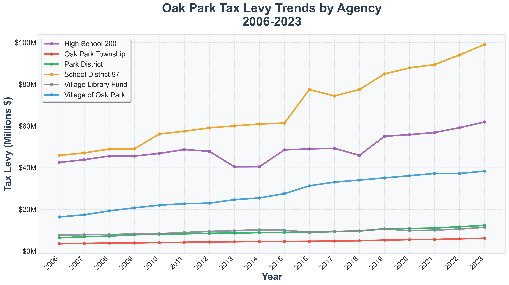
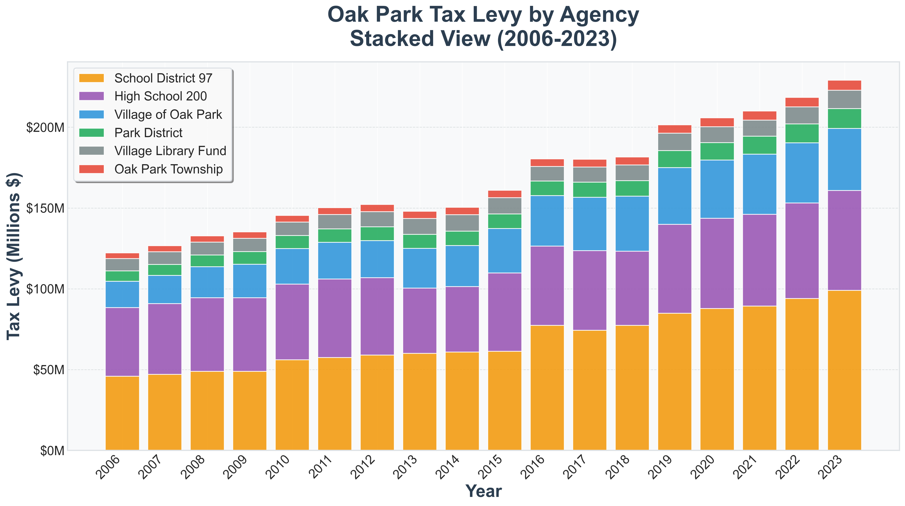
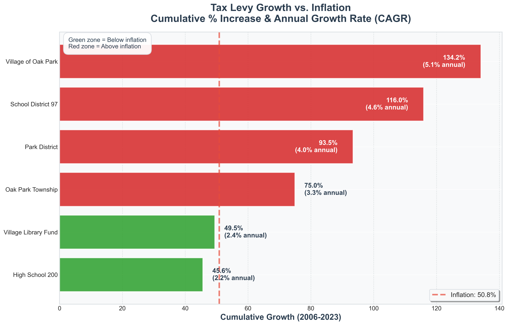

# Oak Park Tax Data Analysis

Automated analysis of Oak Park, Illinois tax levy data from the Cook County Clerk's office (2006-2023).

## Overview

This repository scrapes, extracts, and visualizes tax levy data for six Oak Park taxing agencies:
- Oak Park Township (including General Assistance and Mental Health District)
- Village of Oak Park
- Village Library Fund
- School District 97
- High School District 200 (Oak Park's proportional share)
- Oak Park Park District

## Sample Visualizations

### Historical Trends by Agency


### Total Levy Composition (Stacked)


### Growth vs Inflation


### 2023 Breakdown


## Quick Start

### Prerequisites

- Python 3.x
- Bash shell (for automated setup script)

### One-Command Setup and Run

The easiest way to get started:

```bash
./setup_and_run.sh
```

This script will:
- Create a virtual environment (if needed)
- Install all dependencies
- Download PDFs, extract data, and generate all charts

### Manual Setup

If you prefer manual setup or are on Windows:

1. Clone the repository:
```bash
git clone <repository-url>
cd tax_data
```

2. Create and activate virtual environment:
```bash
python3 -m venv venv
source venv/bin/activate  # On Windows: venv\Scripts\activate
```

3. Install dependencies:
```bash
pip install -r requirements.txt
```

4. Generate all reports:
```bash
python3 generate_all.py
```

This will create:
- `tax_data.csv` - Extracted tax data
- `oak_park_levy_by_year.png` - Historical trends by agency (line chart)
- `oak_park_total_increase_real_inflation.png` - Growth vs inflation comparison (bar chart)
- `oak_park_levy_breakdown.png` - 2023 percentage breakdown (pie chart)
- `oak_park_levy_stacked.png` - Total levy composition by year (stacked bar chart)

## Individual Scripts

### 1. Download PDFs

Download tax reports from Cook County Clerk API:

```bash
# Default: Download 2006 to current year
python3 scrape_tax_pdfs.py

# Specific year
python3 scrape_tax_pdfs.py 2023

# Year range
python3 scrape_tax_pdfs.py 2020-2023
```

PDFs are saved to `tax_pdfs/YYYY/` directories. The script:
- Skips existing files (won't re-download)
- Handles missing years gracefully
- Reports which years had no data

### 2. Extract Data

Parse PDFs and create CSV:

```bash
python3 extract_tax_data.py
```

Extracts from each PDF:
- Year
- Agency code and name
- EAV (Equalized Assessed Value)
- Tax amount (actual extension, not levy request)
- Tax rate

**Important**: High School District 200 values are automatically adjusted to reflect only Oak Park's proportional share (72-76% of total based on EAV).

### 3. Generate Charts

Run individual chart scripts:

```bash
# Line chart: Historical trends by agency (2006-2023)
python3 chart_levy_history.py

# Bar chart: Cumulative growth vs inflation
python3 chart_growth_comparison.py

# Pie chart: 2023 breakdown by agency
python3 chart_levy_breakdown.py

# Stacked bar chart: Total levy composition by year
python3 chart_levy_stacked.py
```

All charts use consistent colors and large, readable fonts.

## Data Files

### tax_data.csv

CSV with extracted data. Columns:
- `year` - Tax year (2006-2023)
- `agency_code` - Cook County agency code
- `agency_name` - Full agency name
- `eav_total` - Total Equalized Assessed Value
- `tax_amount` - Tax extension (actual collected amount)
- `tax_rate` - Tax rate percentage
- `filename` - Source PDF filename

### tax_pdfs/

Directory containing downloaded PDFs organized by year:
```
tax_pdfs/
├── 2006/
│   ├── 020180000_TOWN_OAK_PARK_2006.pdf
│   ├── 030920000_VILLAGE_OF___OAK_PARK_2006.pdf
│   └── ...
├── 2007/
└── ...
```

## Key Technical Details

### Tax Extension vs Levy

The scripts extract **Tax Extension Grand Total** (actual amount collected after PTELL reductions), NOT the Agency Grand Total (requested levy amount).

### District 200 Adjustment

High School District 200 serves multiple communities. The extraction script automatically:
1. Calculates Oak Park's share of D200's total EAV
2. Prorates tax amounts and rates accordingly
3. Results show only Oak Park's portion (typically 72-76%)

### Inflation Data

Growth comparison uses actual historical CPI inflation rates (2006-2023), including:
- 2009: -0.4% (deflation)
- 2022: 8.0% (high inflation)
- Cumulative 2006-2023: 50.8%

### Color Palette

Charts use consistent, distinct colors:
- Red: Oak Park Township
- Blue: Village of Oak Park
- Gray: Village Library Fund
- Orange: School District 97
- Purple: High School 200
- Green: Park District

## Updating Data

To update with latest year's data:

1. Run the scraper (automatically downloads current year if available):
```bash
python3 scrape_tax_pdfs.py
```

2. Re-extract and regenerate:
```bash
python3 generate_all.py
```

The scraper will skip existing files and only download new data.

## Troubleshooting

### No data for recent years
Tax data is typically published several months after the tax year ends. Data for the current year may not be available yet.

### Import errors
Make sure you've activated the virtual environment and installed all dependencies:
```bash
source venv/bin/activate
pip install -r requirements.txt
```

### Chart display issues
Charts are saved as PNG files. View them with any image viewer or import into documents/presentations.

## Project Structure

```
tax_data/
├── README.md                    # This file
├── CLAUDE.md                    # Technical notes and lessons learned
├── requirements.txt             # Python dependencies
├── setup_and_run.sh            # One-command setup and execution
├── generate_all.py              # Master pipeline script
├── scrape_tax_pdfs.py          # Download PDFs from API
├── extract_tax_data.py         # Parse PDFs to CSV
├── chart_levy_history.py       # Generate line chart
├── chart_growth_comparison.py  # Generate bar chart
├── chart_levy_breakdown.py     # Generate pie chart
├── chart_levy_stacked.py       # Generate stacked bar chart
├── tax_data.csv                # Extracted data (generated)
├── tax_pdfs/                   # Downloaded PDFs (generated)
│   └── YYYY/                   # PDFs by year
└── *.png                       # Generated charts
```

## Data Source

Data is sourced from the Cook County Clerk's Tax Extension API:
- **URL**: https://www.cookcountyclerkil.gov
- **API Endpoints**:
  - `/api-tax/public/getreportdata` - Report metadata
  - `/api-tax/public/viewreport` - PDF downloads

## License

This project is for analyzing public tax data. All tax data is provided by Cook County Clerk's office and is public information.
